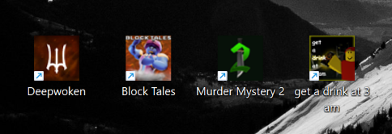

# Roblox Game Shortcut Creator

Simple script that creates desktop shortcuts for Roblox games, as if they were real apps installed on your PC. It automatically fetches the **game's name** and **icon** for you!

Supporting both Windows (using PowerShell) and Linux (using Bash)!



## How to use

### Windows

1. [Download the repository](https://github.com/Ransomwave/Rbx-Shortcut-Launcher/archive/refs/heads/main.zip) or clone it using:
   ```
   git clone https://github.com/Ransomwave/Rbx-Shortcut-Launcher.git
   ```
2. Run the `CreateShortcut.bat` file
3. Input the Game ID _(i.e. https://www.roblox.com/games/**NUMBERHERE**/Your-Game)_
4. Save it to the desktop or any specified location
5. Enjoy your new Roblox game shortcut with a custom icon, as if it were a real app!

### Linux

1. [Download the repository](https://github.com/Ransomwave/Rbx-Shortcut-Launcher/archive/refs/heads/main.zip) or clone it using:
   ```
   git clone https://github.com/Ransomwave/Rbx-Shortcut-Launcher.git
   ```
2. Run `chmod +x ./src/rbx-shortcut-launcher-linux.sh` to give it ability to execute
3. (Optionally) Put it in your `/usr/bin/` folder, so you can call it by simply writing `rbx-shortcut-launcher-linux` (or shorter if you wish) in your terminal
4. Run the script
5. Input the Game ID _(i.e. https://www.roblox.com/games/**NUMBERHERE**/Your-Game)_
6. If it didn't save to desktop already, grab it from current directory (where the script was executed) and drop it to your desktop.
7. Enjoy your new Roblox game shortcut with a custom icon, as if it were a real app!

## Requirements
### Windows
- Windows 10 or higher
- PowerShell 5.1 or higher
### Linux
- Distro with no package manager deviations, and with a Desktop Environment that supports `.desktop` files
- Modern-ish version of Bash
- FFmpeg (image conversion), 
- curl (web requests) 
- jq (json filtering)

## Contributions
Feel free to fork the repository and submit pull requests for improvements or bug fixes.
